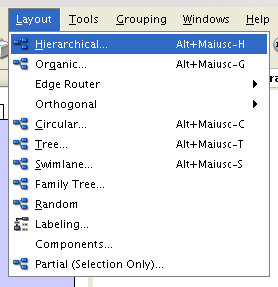
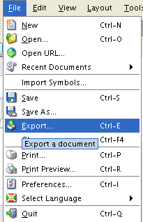

Validation, visualization and manipulation of BCML pathways
===========================================================

Once a BCML compliant file has been written, it needs to be checked. This process, called *validation* is used to ensure that:

 1. The XML file itself is well-formed;
 2. There are no elements that violate the SBGN specification;

Once a BCML file is valid, it can manipulated and used in different ways. These include converting a BCML file to a format suitable for graphical representation, filtering the file according to specific criteria, and exporting the entities to list.

Validating a BCML file
----------------------

BCML files are checked for validity using the ``bcml_check`` utility. The program will ensure first that the file is valid from the point of XML consistency, then it will output any errors regarding SBGN compliance.

A validation run is triggered by running ``bcml_check`` as follows::

        bcml_check --srcSBGN <source BCML file>

Where ``source BCML file`` is your BCML file. Any errors will be outputted to your screen, along with a brief description of where the error occurred, or what kind of violation was encountered.

``bcml_check`` will also verify that the annotations have been inserted correctly and that the terms match the controlled vocabularies of the schema.

Viewing a BCML file
-------------------

BCML files cannot be viewed directly. However, you can convert them to a graphical format (GraphML) and then visualize them with the `yED graphics editor <http://www.yworks.com/en/products_yed_about.html>`_, that supports such a format. From there, you can export to widely-used graphics formats.

The first step involves converting a BCML file to GraphML, a task accomplished by running ``bcml2graphml``::

        bcml2graphml --srcSBGN <source BCML file> 
                     --targetGraphML <destination file>

where ``source BCML file`` is your BCML file and ``destination file`` the name of the file where the converted GraphML will be stored. ``bcml2graphml`` can work recursively: if you supply a path instead of a single file, every valid file in that path will be converted. This is useful if you have many BCML files.

The second step involves loading the yED editor. You can download it or run it directly from the web. Upon launching it, select "Open file" from the greeting screen, and point the file browser to your GraphML file. 

You will notice that all the entities in the pathway are overlapping. This is because they need to be *layouted*. From the Layout menu in yED, select "Hierarchical" (see image) and in the next window, click OK, accepting default parameters. 

The pathway will then assume its right layout. By selecting "Save" from the "File" menu you will be able to save the layouting changes to the GraphML file.

Lastly, you will need to export the file. You can do so by choosing "Export" from the "File" menu:

It is recommended to use SVG or other vector format, which is scalable and can be converted to other formats with the appropriate software (such as the freely available `Inkscape <http://www.inkscape.org>`_). yEd offers some other exporting options, but SVG is the one with best quality. yEd provides the capability to publish the results online, by exporting to the HTML / Adobe flash format.

Filtering a BCML file
---------------------

BCML files can be "filtered" to include or exclude elements and reactions according to user-supplied criteria. For example, one may want to exclude all reactions that do not occur in fibroblasts. This is important because often interactions and pathway entities have been described and proven in some biological contexts but not others.

Filters can be applied on any feature of a BCML file. The most common use case is on the Findings, because the specific annotation is kept there, but in general any kind of element is usable. To actually perform filtering, you will have to use the ``bcml_filter`` program. It is typically invoked like this::

        bcml_filter --srcSBGN <source BCML file> --outFile <destination BCML file>
                    --filterExpr <expression>

As the command line says, the original file (``source BCML file``) is filtered and then written to the destination (``destination BCML file``) using a specific expression (``expression``). The filter expression must be enclosed in double quotes (").

~~~~~~~~~~~~~~~~~~
Filter expressions
~~~~~~~~~~~~~~~~~~

Filter expressions follow a simple logic. Criteria are specified with ``element name='value'``, where ``element name`` can be any element that can be filtered, for example *Organism*, *CellType*, or *ProvenIn*. The criterion must be enclosed in single quotes. Multiple slections can be concatenated with ``and`` (all the conditions must be true) or ``or`` (any of the conditions must be true).

You can nest expressions with brackets, and the ones inside the brackets will be evaluated first than the ones outside.

For example, to filter a pathway for elements only described in *Mus musculus* and in macrophages, a typical filter expression would be::

        "Organism='Mus musculus' and CellType='Macrophage'"

To include instead interactions proven in mouse and in human in dendritic cells, an example would be::

        "(Organism='Mus musculus' or Organism='Homo sapiens') and
         CellType='Dendritic cells (DC)'"

~~~~~~~~~~~~~~~~~~~~~~~~~
Viewing filtered pathways
~~~~~~~~~~~~~~~~~~~~~~~~~

The file produced from the filtering can be then converted to GraphML for viewing. When viewing the graphical representation, items that do not match the filter expression are shown in light gray.

If a "disabled" element participates an interaction of any kind with another entity of the pathway, the interaction will be shown in blue: this indicates that with the current filter selection, the observed interaction may not have sense from a biological point of view.

.. _exporting:

Exporting an entity list from a BCML file
-----------------------------------------

Entities (such as genes) in BCML files can be exported to a plain text format for use in ananalysis (see the relevant section) or for other uses. The ``bcml_export`` program was made for this purpose: extract a plain-text file with identifier information from a BCML file.

A typical invocation of ``bcml_export`` is as follows::

        bcml_export --db <database> --method GeneList --organism <organism>
                    --srcSBGN <source SBGN file> --outFile <destination file>

Like other tools, ``source SBGN file`` and ``destination file`` can be files or file paths: in the latter case, all files will be processed and exported. The ``database`` parameter indicates which database to extract entity information from, and depends on what was annotated inside the various ``<Organism name=...>`` tags in the BCML file. By default, it exports Entrez Gene IDs. ``organism`` indicates the two letter code of the organism to extract identifier information from, and as ``database``, it should be present in the source file.

The result from the export is a plain-text file with the identifiers found, one per line. If the file has been filtered, only the identifiers that match the filter will be outputted: this behavior can be suppressed by adding the ``--disableFilter`` option.
